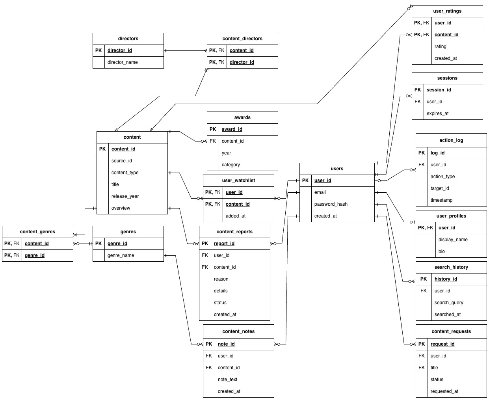

# Movie Watchlist Project - CS 3620

**Course:** CS 3620 Database Systems  
**Tech Stack:** Python (Flask), MySQL

## Project Description

A simple web application where users can create an account to browse a assortment of movies and TV shows. Users can add items to their personal watchlist, rate what they've seen, and get simple analytical insights. The application's content is built by combining a comprehensive movie dataset (TMDB), a TV show dataset (Netflix), and is enriched with historical film awards data (Oscars).

## Project Features

**Authentication / Profiles**
*   User Registration
*   Session Management
*   Profile Customization

**Discovery and Browsing**
*   Top Rated Leaderboard
	* A generated leaderboard of the top 10 highest rated items from users of the app.
*   Award-Winning Collection
	* A view of Oscar-winning movies.
*   Movie & TV Show Search

**User Interactions**
*   Watchlist
*   Ratings
*   Private Notes
*   Reporting / Requests

**Analytics (Dashboard)**
*   My Stats
	* Shows watchlist total and average ratings for a user.
*   Search History
*   Rating History

## Project Requirements

| Requirement             | Features that Meet it                                                                                                 |
| :---------------------- | :-------------------------------------------------------------------------------------------------------------------- |
| **3 Public Datasets**   | 1. TMDB 5000 Movies<br>2. Netflix TV Shows<br>3. The Oscar Awards (1927-2025)                                         |
| **≥16 Tables**          | **16 Tables** implemented (Core, Content, Bridge, Audit, and User Interaction tables).                                |
| **Normalization (3NF)** | `genres` and `directors` were extracted to reference tables, `user_profiles` separated from authentication            |
| **Constraints & Keys**  | Primary/Foreign Keys on all tables, `UNIQUE` emails, `CHECK` the ratings (1.0–5.0).                                   |
| **1 Audit/Log Table**   | `action_log` tracks rating events, `search_history` tracks the user queries.                                          |
| **Interactive Writes**  | Sign Up, Add to Watchlist, Rate Content, Save Notes, and Submit Reports.                                              |
| **3 Analytical Views**  | 1. **Top Rated Leaderboard** (Home)<br>2. **Recent Oscar Winners** (Home)<br>3. **My Stats Dashboard** (User Profile) |
| **Meaningful Data Use** | Movies/Shows unified in one catalog, Oscar data links awards to specific movies.                                      |
| **Access Control**      | Login required for all write actions via `@login_required`.                                                           |
| **Error Handling**      | Python `try/except` blocks catch DB errors (like duplicate emails or invalid ratings).                                |
## Video Recording
https://youtu.be/FR0niecFyvs

## ER Diagram


## Setup & Installation

### Prerequisites
*   Python 3.x
*   MySQL Server

### Instructions

**1. Clone the Repository**
```bash
git clone https://github.com/matthewproboski/movie-watchlist-project-CS-3620.git
cd movie-watchlist-project
```

**2. Set Up Virtual Environment**
```bash
# Windows
python -m venv venv
venv\Scripts\activate

# Mac or Linux
python3 -m venv venv
source venv/bin/activate
```

**3. Install Dependencies**
```bash
pip install -r requirements.txt
```

**4. Configure Database Credentials**
1.  Duplicate `.env.example` and rename it to `.env`.
2.  Edit `.env` with your MySQL credentials:
```text
DB_HOST=127.0.0.1
DB_USER=root
DB_PASSWORD=actual_password
DB_NAME=movie_app
SECRET_KEY=secret_key
```

**5. Build and Populate the Database**
```bash
python setup_database.py
```

**6. Run the Application**
```bash
python app.py
```
Go to: **http://127.0.0.1:5001**

### Other
*   **Reset Database:** To drop and rebuild the entire database:
    ```bash
    python app.py --drop
    ```

## Public Datasets Used

1.  **[TMDB 5000 Movie Dataset](https://www.kaggle.com/datasets/tmdb/tmdb-movie-metadata)**
2.  **[Netflix Movies and TV Shows](https://www.kaggle.com/datasets/shivamb/netflix-shows)**
3.  **[The Oscar Award, 1927 - 2025](https://www.kaggle.com/datasets/unanimad/the-oscar-award)**